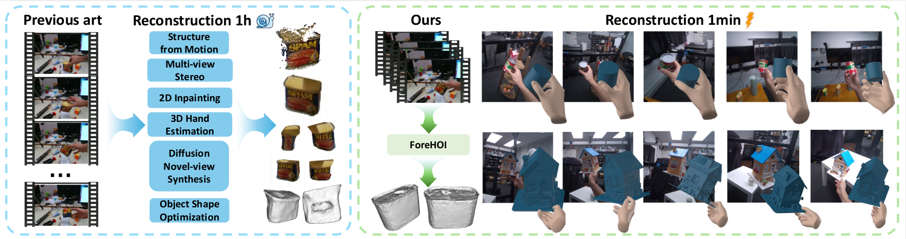

# ForeHOI: Feed-forward 3D Object Reconstruction from Daily Hand-Object Interaction Videos

## Abstract

We introduce ForeHOI, the first feed-forward 3D object reconstruction model from daily hand-object interaction videos. Given partially observed video input, our framework simultaneously completes 2D/3D objects and estimates their poses.

CLICK for the full abstract

> The ubiquity of monocular videos capturing daily hand-object interactions presents a valuable resource for embodied intelligence. While 3D hand reconstruction from in-the-wild videos has seen significant progress, reconstructing the involved objects remains challenging due to severe occlusions and the complex, coupled motion of the camera, hands, and object. In this paper, we introduce ForeHOI, a novel feed-forward model that directly reconstructs 3D object geometry from monocular hand-object interaction videos within one minute of inference time, eliminating the need for any pre-processing steps. Our key insight is that, the joint prediction of 2D mask inpainting and 3D shape completion in a feed-forward framework can effectively address the problem of severe occlusion in monocular hand-held object videos, thereby achieving results that outperform the performance of optimization-based methods. The information exchanges between the 2D and 3D shape completion boosts the overall reconstruction quality, enabling the framework to effectively handle severe hand-object occlusion. Furthermore, to support the training of our model, we contribute the first large-scale, high-fidelity synthetic dataset of hand-object interactions with comprehensive annotations. Extensive experiments demonstrate that ForeHOI achieves state-of-the-art performance in object reconstruction, significantly outperforming previous methods with around a 100x speedup.

## 🚧 Todo

- [] Release the ForeHOI dataset.
- [] Release the inference code.
- [] Release the training code.

## Dataset
Dataset samples are already available on [huggingface](https://huggingface.co/datasets/YuantaoChen/ForeHOI/). The full dataset will be released following the paper acceptance.
